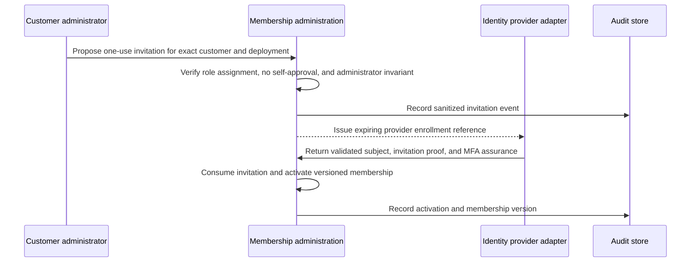
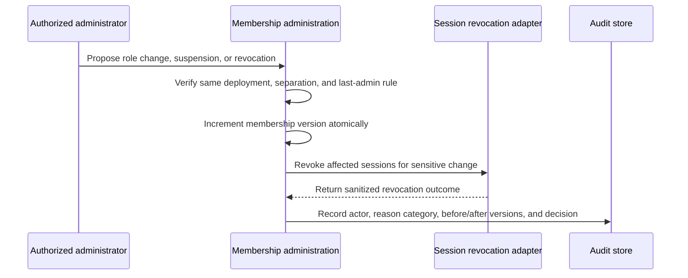

# ADR-023: Portable Enterprise Authorization and User Lifecycle

- **Status**: Proposed; accepted only after independent review and merge
- **Date**: 2026-07-12
- **Scope**: GUG-92 enterprise roles, permissions, grants, user lifecycle,
  privileged access, and portable authorization contract
- **Phase gate**: GUG-117
- **Runtime consumers**: GUG-93 identity/IaC integration, GUG-153 backend
  PDP/PEP enforcement, GUG-94 administrative APIs, and GUG-95 UI/E2E
- **Live enablement**: Blocked pending implementation by downstream consumers,
  reviewed CI, and explicitly authorized non-production evidence

Production: NO-GO

## Context

Scanalyze already binds machine identities to an exact customer and deployment
through ADR-020 and binds documents, batches, and artifacts to the same tuple
through ADR-021. Those controls do not define a complete enterprise human
authorization model. An authenticated user can be validly identified while a
route still lacks proof that the user has an active, current grant for the
requested action and resource.

The repository also lacked one versioned answer for:

- the roles that can be assigned to enterprise users;
- the relationship between OAuth scopes, internal actions, roles, resources,
  object ownership, and data sensitivity;
- invitation, activation, role change, suspension, expiration, and offboarding;
- initial customer administrator bootstrap;
- temporary support and emergency access; and
- migration when tokens, memberships, or deployments use an older contract.

Encoding customer-specific groups, account identifiers, identity-provider
names, or resource identifiers directly in application policy would make the
control impossible to reproduce safely for every customer and account. Relying
only on roles would also create a tenant-isolation failure: a role describes
what a principal may attempt, but never proves which customer's deployment or
which object the principal may access.

GUG-92 therefore defines a provider-neutral policy contract and its security
semantics. It does not change runtime authorization, Cognito, API Gateway,
Terraform, task definitions, live users, or customer data.

## Security objectives

1. Deny unless every required identity, lifecycle, policy, action, resource,
   ownership, assurance, and context condition is explicitly satisfied.
2. Bind every human and service decision to one exact `customer_id` and
   `deployment_id`.
3. Preserve ADR-021 object-level authorization independently of role or scope.
4. Make grants revocable and detect stale tokens without embedding provider
   state in business handlers.
5. Prevent standing platform support or emergency authority.
6. Make the same source policy reusable for any customer, deployment, account,
   region, and supported identity provider through a reviewed adapter.
7. Separate repository, CI, and live evidence so a document cannot be used as
   proof that a control is deployed.

## Actors and trust boundaries

| Actor | Legitimate authority | Explicit boundary |
|---|---|---|
| Enterprise user | Operate resources allowed by one active membership | Never selects customer, deployment, role, ownership, or assurance through request data |
| Customer administrator | Administer approved membership operations inside one deployment | Cannot self-promote, approve their own privileged request, bypass object ownership, or remove the last administrator without an approved replacement |
| Document operator | Create and process documents and batches | No standing `admin`; no full-PII, export, or protected artifact download |
| Document reviewer | Review owned document and batch results | No standing `admin`; sensitive results require a separately approved grant |
| Auditor | Read audit metadata, aggregate metrics, and approved audit evidence | Read-only; no masked/content/PII resource views, mutation, export, or protected artifact authority |
| Service principal | Perform configured workload actions | Uses an M2M binding, never a human role, lifecycle administration, support grant, or break-glass grant |
| Support engineer | Diagnose an approved case | No standing access; exact deployment, operations, expiry, and customer approval are mandatory |
| Emergency operator | Restore a bounded capability during an incident | Human-only, dual-approved, time-limited, strongly authenticated, audited, and automatically revoked |
| Identity provider adapter | Validate provider tokens and normalize signed claims | Cannot grant authority absent from the canonical policy or membership source |
| Policy administration point (PAP) | Publish versioned policy and grants | Separate from request handling; changes require review and audit |
| Policy decision point (PDP) | Evaluate the canonical decision contract | Default deny; returns a decision and reason category, not sensitive data |
| Policy enforcement point (PEP) | Stop or permit the protected operation | Must enforce before protected reads, writes, artifact access, export, or lifecycle effects |
| Policy information point (PIP) | Supply authoritative membership, object, and assurance attributes | Request headers, parameters, payloads, route hints, and legacy aliases are not authoritative |

The mandatory trust transitions are provider token to validated internal
identity, identity to active membership, membership to current policy, request
operation to required actions, resource identifier to authoritative ownership,
and decision to enforcement. Missing or ambiguous evidence at any transition is
a denial.

## Decision

### 1. Hybrid RBAC and mandatory ABAC

Scanalyze uses a closed RBAC catalog for understandable enterprise duties and
mandatory ABAC for isolation, freshness, sensitivity, and context. Authorization
is granted only when all of the following are true at the same time:

1. the token is valid for the expected issuer, audience, token type, and
   provider adapter;
2. the normalized principal type and subject are supported;
3. exactly one human decision path is selected: an `active` enterprise
   membership or an `active` temporary grant, with an exact subject,
   customer, deployment, state, and version binding;
4. the selected membership, temporary grant, or M2M binding carries supported,
   current contract and grant versions;
5. the assigned role, temporary operation allowlist, or reviewed M2M binding
   contains every required action/operation;
6. the requested operation and resource are in the closed policy catalog;
7. `customer_id` and `deployment_id` exactly match the trusted deployment and,
   where applicable, the authoritative resource record;
8. ADR-021 object authorization succeeds independently for every document,
   batch, membership, export member, and artifact;
9. the data classification and authentication assurance meet the operation's
   requirements; and
10. no explicit deny, suspension, expiration, revocation, conflict, legacy-only
    condition, or emergency restriction applies.

Roles never override ownership. An `admin` action is not a platform superuser
and cannot cross a customer or deployment boundary.

### 2. Closed action and OAuth scope catalog

The internal action catalog is exactly:

| Internal action | OAuth scope | Meaning |
|---|---|---|
| `read` | `scanalyze.api.v1/read` | Read an otherwise authorized resource at its permitted data classification |
| `write` | `scanalyze.api.v1/write` | Create or mutate an otherwise authorized resource or workflow state |
| `admin` | `scanalyze.api.v1/admin` | Perform an explicitly cataloged administrative or sensitive operation; never an ownership bypass |

The scopes are pairwise distinct. A token scope is necessary where the principal
type uses OAuth, but never sufficient by itself. Unknown scopes, partial action
sets, wildcard permissions, and token-only elevation fail closed. Human API
calls use access tokens; ID tokens are not API credentials.

### 3. Closed human role catalog

| Role | Resources and allowed duties | Actions | Explicit exclusions |
|---|---|---|---|
| `customer_admin` | Membership administration, deployment settings, owned documents/batches, and approved audit views | `read`, `write`, and cataloged `admin` operations | No cross-deployment access, ownership bypass, self-approval, unrestricted support, or unrestricted full-PII/export |
| `document_operator` | Create, update, process, and organize owned documents and batches | `read`, `write` | No `admin`, role management, audit administration, full-PII, export, or protected artifact download |
| `document_reviewer` | Review owned documents, batches, and masked results | `read`; `write` only for review decisions | No document/batch/profile mutation, `admin`, membership administration, unmasked sensitive result, export, or protected artifact download |
| `auditor` | Audit events, metadata, and aggregate metrics | `read` | No masked/content/PII resource views, mutation, export execution, protected artifact download, role assignment, or emergency authority |

The policy contract, not an identity-provider group name, defines these roles.
Providers may map reviewed immutable group or entitlement identifiers through an
adapter, but display names and request-controlled claims never establish a role.

### 4. Resource and operation policy

Every PEP maps its operation to a canonical resource and required action set.
The minimum matrix is:

| Resource / operation family | Minimum action | Additional mandatory conditions |
|---|---|---|
| Owned document or batch metadata | `read` | Exact customer/deployment and ADR-021 object authorization |
| Owned document or batch mutation | `write` | Exact customer/deployment, immutable ownership, and permitted state transition |
| Employee profile read or mutation | `read` / `write` | Exact ownership, ADR-021 authorization, and allowed data class |
| Masked result read | `read` | Exact object authorization and allowed data class |
| Review read or decision | `read` / `write` | Exact object authorization and allowed review transition |
| Export metadata read | `read` | Same deployment; execution/download remains sensitive |
| Deployment configuration read/change | `read` / `admin` | Customer administrator, same deployment, and no IAM/ownership bypass |
| Metrics read/admin | `read` / `admin` | Deployment-scoped aggregates only; no raw PII |
| Membership read | `read` | Same deployment and an explicitly permitted role |
| Invite, role change, suspend, or revoke membership | `admin` | Customer administrator, no self-approval/elevation, grant-version update, audit, and session revocation where required |
| Audit metadata or masked evidence | `read` | Data-class permission and same deployment |
| `results.read_full` | `read` + `admin` | Exact object authorization and phishing-resistant step-up authentication |
| `exports.execute` | `read` + `admin` | Independent authorization of every member and phishing-resistant step-up authentication |
| `artifacts.download` | `read` + `admin` | Exact stored locator after object authorization and phishing-resistant step-up authentication |

The three sensitive operations retain the stricter ADR-020/ADR-021 policy.
Role membership alone cannot reduce `read` + `admin` to one action. A deployment
may deny additional operations, but cannot grant actions beyond this versioned
catalog without a new reviewed policy version.

### 5. Canonical internal identity and version claims

Provider adapters normalize only validated, signed inputs into a typed internal
context. The canonical context carries, at minimum:

- immutable `subject` and `principal_type`, where the only supported values are
  `user` and `m2m` (`local_mock` remains test-only and cannot authorize a
  deployed request);
- exact `customer_id` and `deployment_id`;
- exactly one `role_id`, `membership_state`, and `membership_version` for the
  membership path; or an exact temporary-grant type, state, and version for
  the temporary-grant path; or a workload binding for M2M;
- common `authz_schema_version`, `scope_catalog_version`, `policy_version`, and
  `policy_digest`;
- membership `role_catalog_version` and `membership_version`, or M2M
  `grant_version`, according to `principal_type`; and
- authentication assurance and authentication time required for step-up checks.

The provider-specific claim name is an adapter concern. The canonical values
remain provider-neutral. Missing, malformed, conflicting, stale, unsupported,
future, or legacy-only versions deny access; they are never treated as the
current version. A role or customer/deployment value from a header, query,
route, payload, cookie, unsigned metadata, display name, or legacy tenant map is
ignored as authority and rejected when it conflicts with trusted context.

The only supported catalog values in v1 are
`authz_schema_version=enterprise-authorization.v1`,
`scope_catalog_version=scanalyze.api.v1`, and
`role_catalog_version=enterprise-roles.v1`. `policy_digest` is the lowercase
SHA-256 digest of the reviewed published policy after RFC 8785 JSON
canonicalization. Request-supplied digests are non-authoritative and comparison
is constant-time.

#### Credential, reset, MFA, federation, and SCIM boundary

The application never stores passwords. A reviewed provider adapter owns
credentials and, when password authentication is enabled, enforces a minimum
length of 14, compromised-password detection, and no static default password.
Privileged operations require phishing-resistant MFA and recent authentication
as specified by the policy.

Password reset and account recovery return enumeration-safe generic outcomes,
never change role, customer, deployment, membership, or grant authority,
revoke active sessions, reconcile the current membership before new access,
and emit sanitized audit evidence. Recovery tokens, factors, and secrets are
never logged. SAML/OIDC federation and SCIM are future reviewed adapter paths;
v1 does not infer membership or authority from federation attributes or SCIM
events.

### 6. Human membership lifecycle

The canonical states are `invited`, `active`, `suspended`, `expired`, and
`revoked`. `expired` and `revoked` are terminal. Allowed transitions are:

- `invited -> active` after invitation proof, exact binding verification, and
  required MFA enrollment;
- `invited -> expired` when the one-use invitation expires;
- `invited|active|suspended -> revoked` through approved offboarding;
- `active -> suspended` through a reviewed security or administrative action;
  and
- `suspended -> active` only after an approved review and new session.

Role changes, suspension, and revocation increment `membership_version`.
Sensitive changes revoke active sessions and invalidate stale tokens. A revoked
membership is never reactivated; reinstatement requires a new invitation and
new membership. No operation may remove the final active `customer_admin`
without an approved replacement in the same customer/deployment.

#### Invitation and activation

An invitation is single-use, bound to the immutable `subject`, customer, and
deployment, expires after at most 24 hours, and requires phishing-resistant MFA
no older than five minutes at activation. Consumption is conditional and
atomic; replay or a conflicting subject denies without revealing membership
existence.



#### Role change, suspension, and offboarding



The lifecycle API returns generic outcomes and never reveals whether a foreign
subject or membership exists.

### 7. Bootstrap of the first customer administrator

Bootstrap is a separate, one-use enrollment capability, not a standing role.
Before issuance, the control plane must already know the exact customer and
deployment from an authoritative registry. Bootstrap requires two independent
approvers, forbids self-approval, is bound to the exact human `subject`, expires
after at most 15 minutes, requires phishing-resistant MFA no older than five
minutes, is consumed atomically, denies replay, records a sanitized audit
event, and becomes unusable after success or expiry.

Self-signup is disabled. Bootstrap cannot choose a customer or deployment from
request input and cannot grant support or emergency privileges. If any binding,
approval, expiry, assurance, or audit prerequisite is missing, the deployment
remains without an active administrator and requires reviewed recovery; it does
not fall back to a shared platform administrator.

### 8. Temporary support access

Support and break-glass use a separate, closed temporary-capability decision
path, not a human role and not a membership bypass. The authoritative temporary
grant store supplies an active, current-version grant bound to exactly one
validated human `subject`, customer, and deployment. Its operation allowlist
must select only v1's read-only diagnostic entries for document/batch metadata,
masked results, review metadata, deployment configuration, aggregate metrics,
or audit metadata. Unknown operations or data classes deny. Exactly one
of membership or temporary grant may authorize a request, and ABAC, object
authorization, and any explicit deny always take precedence.

Support access is just-in-time and has no standing membership. Each grant
requires a case reference, customer approval, exact subject/customer/deployment,
allowlisted operations, phishing-resistant MFA no older than five minutes,
purpose, a maximum one-hour lifetime, current state/version verification on
every use, and independent audit. In v1, full PII, export, and protected
artifact download are unconditionally denied to support; no separate grant can
override this rule.

Support grants auto-revoke at expiry or case closure. Service principals cannot
receive support access, and support cannot administer roles, change ownership,
or mint another support or break-glass grant.

### 9. Break-glass

Break-glass is human-only, incident-bound, dual-approved, individually
attributable, phishing-resistant, exact to one deployment and operation set,
short-lived, continuously audited, automatically revoked, and followed by an
independent review. It is not a human role, M2M action, or routine support path.
It is bound to the exact human `subject`, expires after at most 15 minutes, and
checks the active grant state/version on every use. In v1 it unconditionally
forbids `results.read_full`, `exports.execute`, and `artifacts.download`; an
approval cannot override this closed policy.

Break-glass cannot administer lifecycle or roles, change ownership, or mint a
support/break-glass grant. Identity recovery that needs such an effect is a
separate target-bound, approved recovery workflow, never an emergency-role
side effect.

```mermaid
sequenceDiagram
    participant Operator as Emergency operator
    participant Approvers as Independent approvers
    participant Grant as Emergency grant service
    participant PEP as Policy enforcement point
    participant Audit as Audit and alerting
    Operator->>Approvers: Request incident-bound operations and expiry
    Approvers->>Grant: Provide two independent approvals
    Grant->>Grant: Verify human identity, exact deployment, and strong MFA
    Grant->>Audit: Alert on grant issuance
    Operator->>PEP: Request one allowlisted operation
    PEP->>Grant: Verify current grant, ownership, actions, and restrictions
    Grant-->>PEP: Allow or deny with sanitized reason
    Grant->>Audit: Alert and record every use; auto-revoke at expiry
    Approvers->>Audit: Complete independent post-event review
```

An unavailable approval, audit, revocation, or policy dependency is a denial,
not justification for a standing emergency account.

### 10. Service principals remain separate

M2M principals continue to use ADR-020 bindings and access tokens. Each
confidential workload identity is bound to one workload, customer, deployment,
environment, and reviewed action set. Its default action set is empty. A service
principal cannot inherit human roles, impersonate a user, administer lifecycle,
obtain support access, or obtain break-glass. Read-only M2M cannot mutate,
export, retrieve full PII, or download protected artifacts.

### 11. Audit and privacy

Authorization and lifecycle events record a stable event type, timestamp,
principal category, policy/grant versions, operation, resource category,
decision, sanitized reason, approval references, and correlation reference.
Audit data is integrity-protected and limited to the exact deployment.

Events never contain tokens, cookies, secrets, document contents, PII, extracted
payloads, S3 keys, presigned URLs, invitation secrets, MFA factors, or full
request/response bodies. Customer and deployment identifiers are handled only
in the approved evidence system; general logs and NotebookLM use synthetic or
redacted references. Authorization failures do not reveal whether a foreign
user, membership, document, batch, or artifact exists.

### 12. Provider and account portability

The canonical policy contains no customer, deployment, cloud account, region,
identity-pool, client, ARN, email-domain, or resource instance identifier. A
deployment adapter supplies provider validation configuration and translates
reviewed provider claims to the canonical internal contract. Business PEPs
consume only that contract and the authoritative policy/membership/object
sources.

Every customer and account uses the same schemas, action catalog, role catalog,
validator, negative fixtures, and decision semantics. Per-deployment inputs are
external records whose digests and versions are reviewed; they do not fork the
source policy. A provider adapter may narrow authority but cannot rename actions,
add roles, infer a missing binding, accept an unknown policy version, or bypass
step-up and ownership checks.

## Migration and compatibility

Enterprise authorization v1 is additive to identity v2 and object ownership v1.
Existing identity contracts are not reinterpreted in place.

1. Inventory provider mappings, memberships, role groups, token claims, grants,
   service clients, and route policies outside Git using sanitized categories.
2. Classify each item as fully bound, partially bound, stale, ambiguous,
   conflicting, orphaned, legacy-only, or unsupported.
3. Keep human runtime enablement disabled until GUG-93 provides a reviewed
   adapter and every protected route has a PEP mapping.
4. Create explicit versioned memberships and provider mappings; never infer a
   role from historical use, an email domain, group display name, or neighboring
   deployment.
5. Issue new access tokens only after policy, role, scope, grant, and exact
   customer/deployment versions are available.
6. Run positive and negative tests for two synthetic deployments, then an
   explicitly authorized non-production isolation proof.
7. Revoke old sessions and legacy mappings before enabling the new path.
8. Roll out by an allowlisted deployment cohort with an immediate disable path.

During migration, missing claims, unknown/future versions, stale membership or
grant versions, conflicting mappings, and legacy-only records are denied. There
is no customer-only, group-name, email-domain, ID-token, request-header, or
default-role fallback. GUG-92 performs no live inventory, migration, user
creation, session revocation, or provider change.

## Downstream ownership

- **GUG-92** owns this ADR, the provider-neutral policy/schema, validator,
  synthetic fixtures, migration boundary, and documentation. It does not own
  provider or runtime enablement.
- **GUG-93** owns Cognito/API Gateway and Terraform implementation, access-token
  claim production, version claims, adapter configuration, session revocation
  integration, services handoff, and reusable per-deployment IaC. It must not
  hardcode customer/account values or relax this policy.
- **GUG-153** owns the centralized backend PDP/PEP, exact route-to-operation
  mapping, membership/temporary-grant resolution, version freshness, and
  denial enforcement. It must not invent a legacy or role-only fallback.
- **GUG-94** owns administrative API workflows for invitation, activation,
  role changes, suspension, revocation, bootstrap, support grants, and
  break-glass requests. It must implement separation of duties, enumeration-safe
  responses, version increments, and audit without exposing secrets or PII.
- **GUG-95** owns the user/role console and privilege E2E coverage; UI state is
  never authority and cannot substitute for GUG-153/GUG-94 enforcement.
- **GUG-117** remains the phase gate for reviewed integration, two-deployment
  isolation, negative authorization evidence, recovery, and evidence taxonomy.

If a runtime enforcement surface is not explicitly owned by an existing
downstream issue, it must receive a separate issue before enablement; ambiguity
is not permission to absorb the work into GUG-92 or deploy a partial control.

## Alternatives considered

### Provider groups as the complete policy

Rejected. Group display names and provider-specific behavior are not portable,
do not prove object ownership or lifecycle freshness, and encourage business
handlers to depend directly on the provider.

### Role-only RBAC

Rejected. A role cannot express exact customer/deployment binding, object
ownership, grant freshness, data classification, step-up authentication, or
incident constraints.

### Pure ABAC without named roles

Rejected for v1. It can express the controls but makes enterprise administration,
review, least-privilege reasoning, and support handoff harder. Stable closed
roles plus mandatory ABAC provide an understandable and enforceable model.

### One platform administrator or standing support role

Rejected. It creates cross-customer blast radius, weak attribution, and an easy
path around customer approval. Bootstrap, support, and break-glass are separate,
expiring capabilities.

### Embed customer/account policy variants in source

Rejected. Forked policies drift, cannot be validated uniformly, and risk
copying authority between customers. External exact bindings plus one canonical
policy are required.

### Accept stale or legacy tokens during a compatibility window

Rejected. Silent fallback would preserve the authorization ambiguity this
decision is intended to remove. Migration remains explicit and fail closed.

## Consequences

### Positive

- Enterprise duties are reviewable through four stable roles.
- Tenant and object isolation remain mandatory even for administrators.
- Policy, role, scope, and grant versions make revocation and migration explicit.
- Provider adapters isolate Cognito or a future enterprise IdP from business
  authorization semantics.
- Support and emergency access have bounded, attributable workflows instead of
  standing privilege.
- One policy package and synthetic suite can be reused for every customer and
  account.

### Costs and residual risk

- The PDP/PAP/PEP/PIP split and version checks add implementation complexity.
- Token revocation is not instantaneous unless downstream consumers enforce
  current membership/grant versions or sufficiently short token lifetimes.
- Privileged workflow independence requires organizational controls that a
  single maintainer cannot self-attest.
- The current runtime does not enforce the human role catalog. Until GUG-93,
  GUG-94, route PEP integration, and GUG-117 evidence are complete, residual
  risk remains High and human enterprise enablement remains blocked.

## Validation and evidence boundary

| Evidence class | Meaning for this decision |
|---|---|
| **Implemented** | The exact reviewed revision contains ADR-023, the versioned policy/schema, semantic validator, synthetic fixtures, and reference documentation. This is contract implementation, not runtime enforcement. |
| **Locally validated** | Named offline schema, semantic, documentation, security, and repository checks pass for the exact revision without provider or customer data. |
| **CI validated** | Required PR checks pass for the exact commit. This does not prove identity-provider, session-revocation, API, or deployment behavior. |
| **Live validated** | Explicitly authorized, sanitized non-production evidence proves provider claims, lifecycle, revocation, role/action/resource enforcement, exact tenant/object isolation, support, and emergency workflows. No such claim is made here. |
| **Blocked** | Cognito/API Gateway/IaC integration, runtime PEP coverage, admin workflows, live migration, two-deployment isolation, production, and merge remain separately controlled. |

Approval of this ADR accepts the target contract; it does not mark downstream
implementation or live validation complete. Skipped or blocked checks are never
reported as passed.

## Rollback

Revert the reviewed repository contract through the normal Git workflow and
keep human enterprise authorization disabled if exact semantics cannot be
preserved. Do not roll back to implicit groups, a default role, customer-only
binding, ID-token API access, stale grants, standing support, standing
break-glass, or role-only object authorization.

If a downstream deployment has consumed this contract, rollback requires a
separately approved compatibility plan that disables affected PEPs safely,
revokes sessions/grants, preserves audit evidence, and returns uncertain
memberships to denied treatment. This ADR authorizes no live rollback action.

## References

- NIST SP 800-162, *Guide to Attribute Based Access Control Definition and
  Considerations*: <https://csrc.nist.gov/pubs/sp/800/162/upd2/final>
- NIST SP 800-205, *Attribute Considerations for Access Control Systems*:
  <https://doi.org/10.6028/NIST.SP.800-205>
- NIST SP 800-207A, *A Zero Trust Architecture Model for Access Control in
  Cloud-Native Applications*: <https://csrc.nist.gov/pubs/sp/800/207/a/final>
- NIST SP 800-63B-4, *Authentication and Authenticator Management*:
  <https://pages.nist.gov/800-63-4/sp800-63b/aal/>
- RFC 6749, *The OAuth 2.0 Authorization Framework*:
  <https://www.rfc-editor.org/rfc/rfc6749>
- RFC 8725, *JSON Web Token Best Current Practices*:
  <https://www.rfc-editor.org/rfc/rfc8725>
- RFC 9068, *JSON Web Token Profile for OAuth 2.0 Access Tokens*:
  <https://www.rfc-editor.org/rfc/rfc9068>
- RFC 9700, *Best Current Practice for OAuth 2.0 Security*:
  <https://www.rfc-editor.org/rfc/rfc9700>
- RFC 7643 and RFC 7644 for a future reviewed SCIM lifecycle adapter:
  <https://www.rfc-editor.org/rfc/rfc7643> and
  <https://www.rfc-editor.org/rfc/rfc7644>
- AWS Well-Architected, *Establish a process for emergency access*:
  <https://docs.aws.amazon.com/wellarchitected/latest/framework/sec_permissions_emergency_process.html>

These references inform the design. Requirements in this ADR are Scanalyze
decisions unless a cited standard or applicable obligation explicitly says
otherwise.
